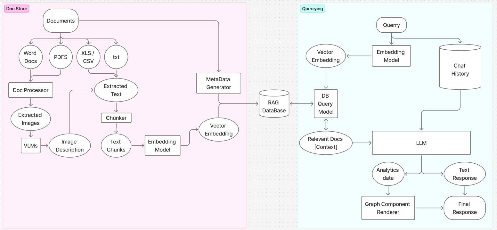

# 🤖 CogniScript RAG Server

**A powerful Retrieval-Augmented Generation (RAG) chatbot server built with Flask, ChromaDB, and modern NLP techniques.**

CogniScript enables intelligent document-based conversations by combining the power of Large Language Models (LLMs) with semantic document retrieval. Upload documents, create isolated chat sessions, and get contextually-aware responses backed by your own knowledge base.

---

## ✨ Key Features

### 🧠 **Advanced RAG Pipeline**
- **Intelligent Context Retrieval:** Uses ChromaDB vector similarity search to find relevant document sections
- **Multi-Document Support:** Upload PDFs, DOCs, and text files with automatic processing
- **Smart Chunking:** Recursive text splitting with configurable overlap for optimal embedding

### 💬 **Isolated Chat Sessions**
- **Per-Chat Vector Databases:** Each conversation has its own ChromaDB collection
- **Conversation History:** Maintains context across multiple exchanges
- **Citation Tracking:** Automatic source attribution for generated responses

### 🔧 **Flexible Document Processing**
- **Text Extraction:** Extract content from various document formats
- **Text Cleaning:** Remove noise and normalize content for better embeddings
- **High Dimension Embeddings:** HuggingFace model integration for high-quality vector representations

### 🚀 **Production-Ready APIs**
- **RESTful Design:** Clean, well-documented endpoints for all operations  
- **Error Handling:** Comprehensive error responses and logging
- **Health Monitoring:** Built-in health checks for system components
- **Scalable Architecture:** Modular design supporting easy extension

---

## 🚀 Quick Start

1. **Clone the repository:**
	```powershell
	git clone <repo-url>
	cd CogniScript_Server
	```

2. **Create a virtual environment (recommended):**
   ```bash
   python -m venv venv
   ```

3. **Activate the virtual environment:**
   
   **Windows:**
   ```powershell
   .\venv\Scripts\activate
   ```
   
   **macOS/Linux:**
   ```bash
   source venv/bin/activate
   ```

4. **Install dependencies:**
   ```bash
   pip install -r requirements.txt
   ```

5. **Configure environment variables:**
   - Copy `.env.example` to `.env` and edit the values as needed for your setup:
     
     **Windows:**
     ```powershell
     copy .env.example .env
     ```
     
     **macOS/Linux:**
     ```bash
     cp .env.example .env
     ```
     
   - Edit `.env` in your editor and fill in all required values (MongoDB, API keys, etc.)

6. **Run the server:**
   ```bash
   python app.py
   ```

7. **Test the APIs:**
   - See [docs/routes.md](docs/routes.md) for a full list of API endpoints and usage
   - (Optional) Import the Postman collection (if provided) for easy API testing

---

## ⚙️ **LLM Provider Configuration**

CogniScript uses **LangChain** framework for seamless integration with multiple Language Model providers. The server automatically routes prompts to your selected LLM provider based on environment configuration.

### **🔄 How LLM Provider Selection Works**

1. **Server Startup:** The system reads `LLM_PROVIDER` from your `.env` file
2. **Provider Initialization:** LangChain creates the appropriate provider client (OpenAI, Gemini, etc.)
3. **API Key Validation:** Verifies the corresponding API key is configured
4. **Request Routing:** All chat prompts are automatically sent to the selected provider

### **🎯 Available Providers**
Configure `LLM_PROVIDER` in your `.env` file to one of these options:

- **`Perplexity`** - Real-time web search capabilities
- **`OpenAI`** - GPT models (gpt-3.5-turbo, gpt-4, etc.)
- **`Gemini`** - Google's multimodal AI models
- **`Groq`** - Ultra-fast inference hardware
- **`Anthropic`** - Claude models for advanced reasoning

### **🔧 Environment Configuration Example**
```bash
# Set your preferred LLM provider
LLM_PROVIDER=Perplexity

# Configure the corresponding API key
PERPLEXITY_API_KEY=your_api_key_here
```

### **🎨 Custom Model Selection**
To use specific models instead of defaults, modify the `DEFAULT_MODELS` dictionary in:
```
services/langchain_chatbot_service.py
```

**Current defaults:**
- **OpenAI:** `gpt-4o-mini`
- **Gemini:** `gemini-2.5-flash` 
- **Groq:** `mixtral-8x7b-32768`
- **Anthropic:** `claude-3-sonnet-20240229`
- **Perplexity:** `sonar`

**Example customization:**
```python
DEFAULT_MODELS = {
    "OpenAI": "gpt-4",  # Change to GPT-4 instead of gpt-4o-mini
    "Gemini": "gemini-pro",  # Use Gemini Pro
    # ... other providers
}
```

> **⚠️ Important:** Restart the server after changing provider settings or model configurations.

---

## 🏗️ Architecture Overview

CogniScript follows a modular, scalable architecture designed for production RAG applications:

### 🗺️ Architecture Diagram




### 🔄 **Document Ingestion Workflow**
1. **Upload:** Client uploads document via `/chats/{chat_id}/upload`
2. **Extract:** Text extraction from PDF/DOC using specialized libraries
3. **Clean:** Text normalization and noise removal
4. **Chunk:** Recursive splitting with configurable overlap
5. **Embed:** Generate vector embeddings using HuggingFace models
6. **Store:** Save vectors and metadata to ChromaDB collection

### 💭 **RAG Query Workflow**
1. **Prompt:** User sends query via `/chats/{chat_id}/prompt`
2. **Embed:** Convert query to vector embedding
3. **Search:** Find relevant document chunks using vector similarity
4. **Context:** Format retrieved chunks as context for LLM
5. **Generate:** LLM generates response using context + conversation history
6. **Cite:** Extract and return source citations for transparency

---

## 🗄️ **ChromaDB Integration**

CogniScript leverages **ChromaDB** for efficient vector storage and retrieval:

- **🔐 Isolated Collections:** Each chat session gets its own ChromaDB collection (`{collection_prefix}{chat_id}`)
- **📊 Rich Metadata:** Documents stored with filename, chunk indices, and timestamps
- **🔍 Semantic Search:** Query documents using natural language with vector similarity
- **⚡ Fast Retrieval:** Optimized for low-latency RAG applications
- **🔄 CRUD Operations:** Full lifecycle management of vector databases

### **Supported Operations:**
- Create chat-specific vector databases
- Upload and embed documents with automatic chunking
- Semantic search across document collections
- Retrieve document metadata and statistics
- Delete collections and cleanup resources

---

## 📖 **Documentation**

### 🔗 **Complete Endpoint Reference**
See [**docs/routes.md**](docs/routes.md) for comprehensive API documentation including:
- All available endpoints with HTTP methods
- Request body schemas and parameters
- Expected response formats and status codes
- Error handling and validation rules

### 📊 **Data Models & Storage Architecture**
See [**docs/data-models.md**](docs/data-models.md) for detailed information about:
- MongoDB collection schemas (Users, Chats, Documents, Citations)
- ChromaDB vector storage structure and metadata
- Data relationships and entity diagrams
- Query patterns and optimization strategies
- Database maintenance and scalability considerations

### 🧪 **Testing & Development**
- **Postman Collection:** Import the provided JSON for easy API testing
- **Health Endpoints:** Built-in health checks for system monitoring
- **Detailed Logging:** Comprehensive error tracking and debugging support

---

## 🚀 **Getting Started Examples**

### **Create a User and Chat Session**
```bash
# Create a new user
curl -X POST http://localhost:3000/users \
  -H "Content-Type: application/json" \
  -d '{"email": "user@example.com", "user_type": "standard"}'

# Create a new chat
curl -X POST http://localhost:3000/chats \
  -H "Content-Type: application/json" \
  -d '{"userId": "user_id_here", "title": "My First RAG Chat"}'
```

### **Upload a Document and Ask Questions**
```bash
# Upload a document to the chat
curl -X POST http://localhost:3000/chats/{chat_id}/upload \
  -F "file=@your_document.pdf"

# Ask a question about the document
curl -X POST http://localhost:3000/chats/{chat_id}/prompt \
  -H "Content-Type: application/json" \
  -d '{"prompt": "What are the main points discussed in the document?"}'
```

---

## 🛠️ **Tech Stack**

### **🏗️ Core Framework**
- **Backend Framework:** Flask (Python web server)
- **LLM Orchestration:** **LangChain** - Modern conversation management and multi-provider LLM integration
- **Vector Database:** ChromaDB - Semantic document search and retrieval
- **Document Database:** MongoDB - User data, chat history, and metadata storage

### **🤖 AI & Machine Learning**
- **Language Models:** Multi-provider support via LangChain integrations:
  - `langchain-openai` - OpenAI GPT models
  - `langchain-google-genai` - Google Gemini models  
  - `langchain-groq` - Groq ultra-fast inference
  - `langchain-anthropic` - Anthropic Claude models
  - `langchain-perplexity` - Perplexity real-time search models
- **Embeddings:** HuggingFace Transformers (`sentence-transformers`)
- **Text Processing:** LangChain text splitters and utilities

### **📄 Document Processing**
- **PDF Processing:** PyMuPDF - Advanced PDF text extraction
- **Text Documents:** python-docx - Word document processing
- **Text Chunking:** LangChain recursive character text splitter

---

## 🤝 **Contributing**

We welcome contributions! Whether you're fixing bugs, improving documentation, or adding new features:

1. **Fork the repository**
2. **Create a feature branch:** `git checkout -b feature/amazing-feature`
3. **Make your changes** and add tests if applicable
4. **Commit your changes:** `git commit -m 'Add amazing feature'`
5. **Push to the branch:** `git push origin feature/amazing-feature`
6. **Open a Pull Request**

For major changes, please open an issue first to discuss what you would like to change.

---

## 📄 **License**

This project is licensed under the MIT License - see the [LICENSE](LICENSE) file for details.

---

## 🙏 **Acknowledgments**

### **🦜🔗 Core AI Framework**
- **LangChain** - For the powerful LLM orchestration framework, modern conversation management patterns, and seamless multi-provider integrations

### **🤖 AI & ML Providers**  
- **OpenAI** - GPT models and API infrastructure
- **Google** - Gemini models and AI capabilities
- **Anthropic** - Claude models for advanced reasoning
- **Groq** - Ultra-fast LLM inference hardware
- **Perplexity** - Real-time web search AI models
- **HuggingFace** - State-of-the-art embedding models and transformers library

### **📊 Database & Storage**
- **ChromaDB** - Excellent vector database solution for semantic search
- **MongoDB** - Robust document database for scalable data storage

### **🛠️ Development Tools**
- **Flask** - Robust and flexible Python web framework
- **PyMuPDF** - Advanced PDF processing capabilities
- **python-docx** - Word document processing utilities
- **Pydantic** - Data validation and settings management

---

<div align="center">

**⭐ If you find CogniScript helpful, please give it a star! ⭐**

Made with ❤️ for the RAG community

</div>
